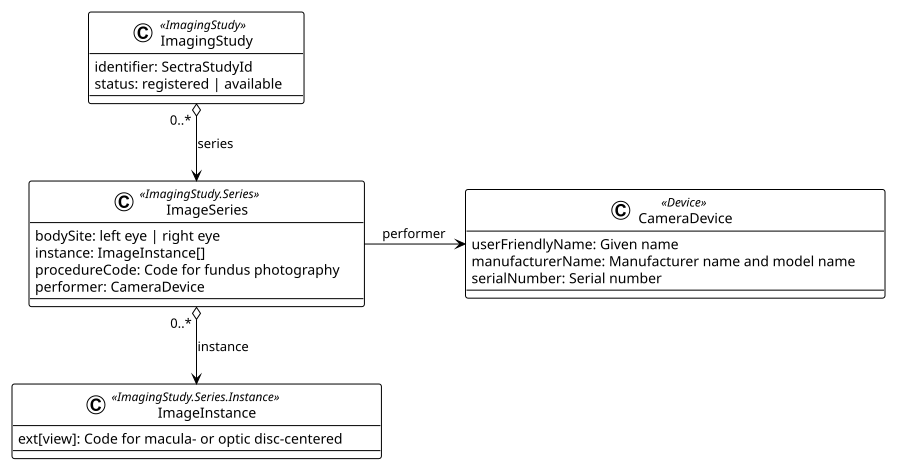

# Retina ImagingStudy - RetinaIntegration v0.5.0

* [**Table of Contents**](toc.md)
* [**Artifacts Summary**](artifacts.md)
* **Retina ImagingStudy**

## Resource Profile: Retina ImagingStudy ( Experimental ) 

| | |
| :--- | :--- |
| *Official URL*:http://dips.no/fhir/RetinaIntegration/StructureDefinition/retina-imagingstudy | *Version*:0.5.0 |
| Draft as of 2025-12-02 | *Computable Name*:RetinaImagingStudy |

 
Profile for imaging studies related to retina examinations, including fundus photography and OCT imaging. 

### Overview

The RetinaImagingStudy profile is used to document imaging studies performed during retina screening examination.

The study will include what type of study was done (fundus photography or Optical Coherence Tomography (OCT)), what camera was used, a reference to the Sectra Media Archive, a description of the picture taken.

### Structure

Structure of ImagingStudy after information about the images is added by the AI system. The `ImagingSystem.status` will then be `available`. Before the series is added the status will be `registered`.



### Key Elements

#### Status changes during the EyeCare Retinopathy Workflow

| | | | | |
| :--- | :--- | :--- | :--- | :--- |
| Of the possible statuses of a ImagingStudy (registered | available | cancelled | entered-in-error | unknown) we use the following two stages: |

* `registered`: The photographer has registered the EyeCare form and DIPS has connected the examination with a Sectra study.
* `available`: The AI system has appended information about the image study.

#### identifier

The identifier is the study's ID in the Sectra media archive. It is set by DIPS after DIPS has matched a study to an examination.

Identifier slice: `sectraStudyId`

System: `http://dips.no/fhir/RetinaIntegration/sectra-image-study-id`

#### Subject

Reference to the patient for whom the imaging was performed. This is mandatory and must reference a Patient resource.

#### procedureCode

The procedure code specifies if OCT or fundus photography was taken.

This code is set when AI system append the image information.

Valid codes are [RetinaImagingProcedureValueSet](ValueSet-retina-imaging-procedure-vs.md):

* CKDP10 `http://ehelse.no/fhir/CodeSystem/no-kodeverk-7275#CKDP10` for fundus photography
* CKFX16 `http://ehelse.no/fhir/CodeSystem/no-kodeverk-7275#CKFX16` for OCT examination of eye fundus structures using light-wave based technique

#### Series

After AI has appended results, the `ImagingStudy.Series` will be populated with one series for each eye. Each series will have a `bodySite` indicating left or right eye and several image `Instance`s. Each image instance will have a `view` extension indicating macula or optic disc centring.

Each series may also have a CameraDevice as `performer`.

**Usages:**

* Refer to this Profile: [Retina DiagnosticReport](StructureDefinition-retina-diagnostic-report.md)
* Examples for this Profile: [ImagingStudy/RetinaImagingStudy-available-Example](ImagingStudy-RetinaImagingStudy-available-Example.md) and [ImagingStudy/RetinaImagingStudy-registered-Example](ImagingStudy-RetinaImagingStudy-registered-Example.md)

You can also check for [usages in the FHIR IG Statistics](https://packages2.fhir.org/xig/dips.fhir.retinaintegration|current/StructureDefinition/retina-imagingstudy)

### Formal Views of Profile Content

 [Description of Profiles, Differentials, Snapshots and how the different presentations work](http://build.fhir.org/ig/FHIR/ig-guidance/readingIgs.html#structure-definitions). 

 

Other representations of profile: [CSV](StructureDefinition-retina-imagingstudy.csv), [Excel](StructureDefinition-retina-imagingstudy.xlsx), [Schematron](StructureDefinition-retina-imagingstudy.sch) 


## Resource Content

```json
{
  "resourceType" : "StructureDefinition",
  "id" : "retina-imagingstudy",
  "url" : "http://dips.no/fhir/RetinaIntegration/StructureDefinition/retina-imagingstudy",
  "version" : "0.5.0",
  "name" : "RetinaImagingStudy",
  "title" : "Retina ImagingStudy",
  "status" : "draft",
  "experimental" : true,
  "date" : "2025-12-02",
  "publisher" : "DIPS AS",
  "contact" : [
    {
      "name" : "DIPS AS",
      "telecom" : [
        {
          "system" : "url",
          "value" : "http://dips.no/"
        },
        {
          "system" : "email",
          "value" : "teamsolsiden@dips.no"
        }
      ]
    }
  ],
  "description" : "Profile for imaging studies related to retina examinations, including fundus photography and OCT imaging.",
  "fhirVersion" : "4.0.1",
  "mapping" : [
    {
      "identity" : "workflow",
      "uri" : "http://hl7.org/fhir/workflow",
      "name" : "Workflow Pattern"
    },
    {
      "identity" : "rim",
      "uri" : "http://hl7.org/v3",
      "name" : "RIM Mapping"
    },
    {
      "identity" : "dicom",
      "uri" : "http://nema.org/dicom",
      "name" : "DICOM Tag Mapping"
    },
    {
      "identity" : "w5",
      "uri" : "http://hl7.org/fhir/fivews",
      "name" : "FiveWs Pattern Mapping"
    },
    {
      "identity" : "v2",
      "uri" : "http://hl7.org/v2",
      "name" : "HL7 v2 Mapping"
    }
  ],
  "kind" : "resource",
  "abstract" : false,
  "type" : "ImagingStudy",
  "baseDefinition" : "http://hl7.org/fhir/StructureDefinition/ImagingStudy",
  "derivation" : "constraint",
  "differential" : {
    "element" : [
      {
        "id" : "ImagingStudy",
        "path" : "ImagingStudy"
      },
      {
        "id" : "ImagingStudy.implicitRules",
        "path" : "ImagingStudy.implicitRules",
        "max" : "0"
      },
      {
        "id" : "ImagingStudy.modifierExtension",
        "path" : "ImagingStudy.modifierExtension",
        "max" : "0"
      },
      {
        "id" : "ImagingStudy.identifier",
        "path" : "ImagingStudy.identifier",
        "slicing" : {
          "discriminator" : [
            {
              "type" : "value",
              "path" : "system"
            }
          ],
          "rules" : "open"
        },
        "min" : 1,
        "mustSupport" : true
      },
      {
        "id" : "ImagingStudy.identifier:sectraStudyId",
        "path" : "ImagingStudy.identifier",
        "sliceName" : "sectraStudyId",
        "short" : "Sectra Study Identifier.",
        "definition" : "Unique identifier for the imaging study in the Sectra Media Archive system.",
        "min" : 1,
        "max" : "1",
        "mustSupport" : true
      },
      {
        "id" : "ImagingStudy.identifier:sectraStudyId.use",
        "path" : "ImagingStudy.identifier.use",
        "max" : "0"
      },
      {
        "id" : "ImagingStudy.identifier:sectraStudyId.system",
        "path" : "ImagingStudy.identifier.system",
        "min" : 1,
        "patternUri" : "http://dips.no/fhir/RetinaIntegration/sectra-image-study-id"
      },
      {
        "id" : "ImagingStudy.status",
        "path" : "ImagingStudy.status",
        "short" : "Status of the imaging study: registered (SectraId identified) | available (Image information appended by AI system and is available).",
        "mustSupport" : true
      },
      {
        "id" : "ImagingStudy.subject",
        "path" : "ImagingStudy.subject",
        "short" : "Patient who is the subject of the imaging study.",
        "type" : [
          {
            "code" : "Reference",
            "targetProfile" : ["http://hl7.org/fhir/StructureDefinition/Patient"]
          }
        ]
      },
      {
        "id" : "ImagingStudy.procedureCode",
        "path" : "ImagingStudy.procedureCode",
        "short" : "OCT or Fundus Photography procedure (after AI analysis).",
        "max" : "1",
        "mustSupport" : true,
        "binding" : {
          "strength" : "required",
          "valueSet" : "http://dips.no/fhir/RetinaIntegration/ValueSet/retina-imaging-procedure-vs"
        }
      },
      {
        "id" : "ImagingStudy.series",
        "path" : "ImagingStudy.series",
        "short" : "Image series will be added by the AI system.",
        "definition" : "Collection of images organized by left eye, right eye."
      },
      {
        "id" : "ImagingStudy.series.uid",
        "path" : "ImagingStudy.series.uid",
        "short" : "Series Instance UID."
      },
      {
        "id" : "ImagingStudy.series.bodySite",
        "path" : "ImagingStudy.series.bodySite",
        "short" : "Body site (eye) for this series.",
        "definition" : "Specifies which eye (left or right retina) this series documents. All images in a series must be from the same eye.",
        "min" : 1,
        "binding" : {
          "strength" : "required",
          "valueSet" : "http://dips.no/fhir/RetinaIntegration/ValueSet/retina-body-site-vs"
        }
      },
      {
        "id" : "ImagingStudy.series.performer",
        "path" : "ImagingStudy.series.performer",
        "short" : "Device that captured the images in this series."
      },
      {
        "id" : "ImagingStudy.series.instance",
        "path" : "ImagingStudy.series.instance",
        "short" : "Individual image instances in this series.",
        "definition" : "Each instance represents a single retinal image within this series.",
        "min" : 1
      },
      {
        "id" : "ImagingStudy.series.instance.extension",
        "path" : "ImagingStudy.series.instance.extension",
        "slicing" : {
          "discriminator" : [
            {
              "type" : "value",
              "path" : "url"
            }
          ],
          "ordered" : false,
          "rules" : "open"
        },
        "min" : 1
      },
      {
        "id" : "ImagingStudy.series.instance.extension:view",
        "path" : "ImagingStudy.series.instance.extension",
        "sliceName" : "view",
        "short" : "Image view/centering",
        "definition" : "The centering or anatomical focus of this specific retinal image.",
        "min" : 1,
        "max" : "1",
        "type" : [
          {
            "code" : "Extension",
            "profile" : [
              "http://dips.no/fhir/RetinaIntegration/StructureDefinition/retinal-image-view"
            ]
          }
        ]
      },
      {
        "id" : "ImagingStudy.series.instance.uid",
        "path" : "ImagingStudy.series.instance.uid",
        "short" : "Image Instance UID.",
        "definition" : "Unique identifier for this individual image, generated by the AI system."
      }
    ]
  }
}

```
