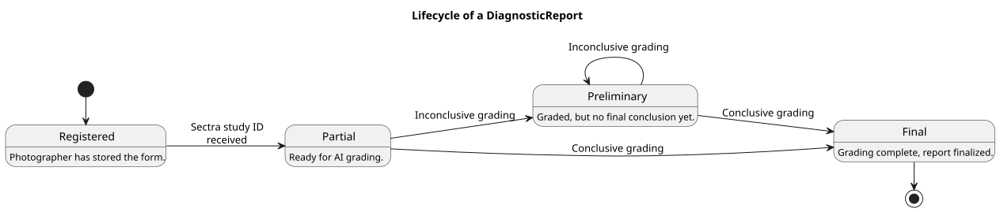
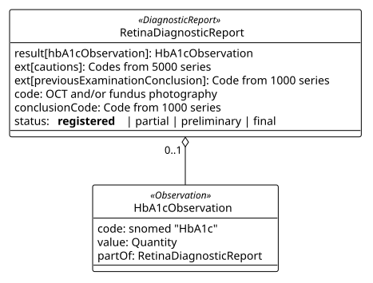
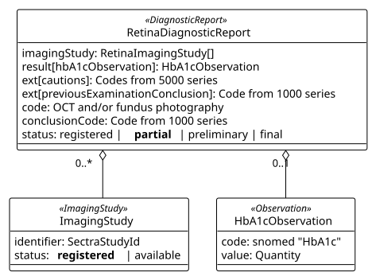
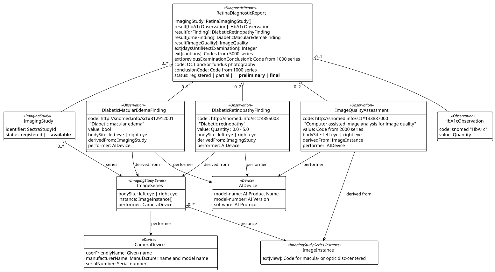

# Model - RetinaIntegration v0.9.0

## Model

### Retina DiagnosticReport Model

The diagnostic report goes through phases as the grading process progress. These phases are reflected in the `DiagnosticReport.status` field.

1. `registered`: The report exists but it does not contain any information about images. It may contain information about HbA1c.
1. `partial`: The report has information about`ImagingStudy`, one or more SectraStudyIDs are connected to the examination.
1. `preliminary`: AI system has added information an possible conclusions about an ImagingStudy but the grading process is not finished.
1. `final`: The grading process has reached a conclusion.

#### DiagnosticReport.status = registered

The report will be in `registered`state after the photographer has saved and approved the photographer form in EyeCare and before any imaging studies are connected to the examination.

Available information in the `registered` state is:

* hbA1cObservation result containing the blood sugar value reported by the patient.
* cautions extension : optional codes from the 5000-series (if any), e.g. 5001 "Patient does not want an AI based grading result."
* previousExaminationConclusion : conclusionCode from previous examination (if any), from the 1000 series.
* code : Type of imaging ordered, fundus photography and/or OCT from RetinaImagingProcedureValueSet.

Many of the objects in the model will contain a subject identifier for the patient. Many objects will also have `partOf`references back to the diagnostic report. These references are for simplicity omitted from this overview.

#### DiagnosticReport.status = partial

When a Sectra imaging study is mapped to the examination a `ImagingStudy` is added to the report. The status of the ImagingStudy will be `registered` and the status of the diagnostic report will be `partial` meaning there is data available.

The diagnostic report may contain zero, one or several imaging studies.

One imaging study will contain one and exactly on sectraStudyId identifier.

#### DiagnosticReport.status = preliminary | final

The AI system will add information about the images and a result of the AI grading of the pictures.

AI will add two image series to the imaging study, on for each eye. The ImagingSeries.bodySite will have snomed codes for retina left or right eye.

AI will add assessment of the image quality for each image in the study.

For each picture the AI will report the `view` which is macular centred or optical disc centred. This information originates in the camera system and is not assessed by the AI system. It is therefor not an observation or evaluation, but a property of the image.

The AI system will add evaluations (observations) about possible diabetic retinopathy finding and diabetic macular edema finding.

A DiagnosticReport after AI result is added.

