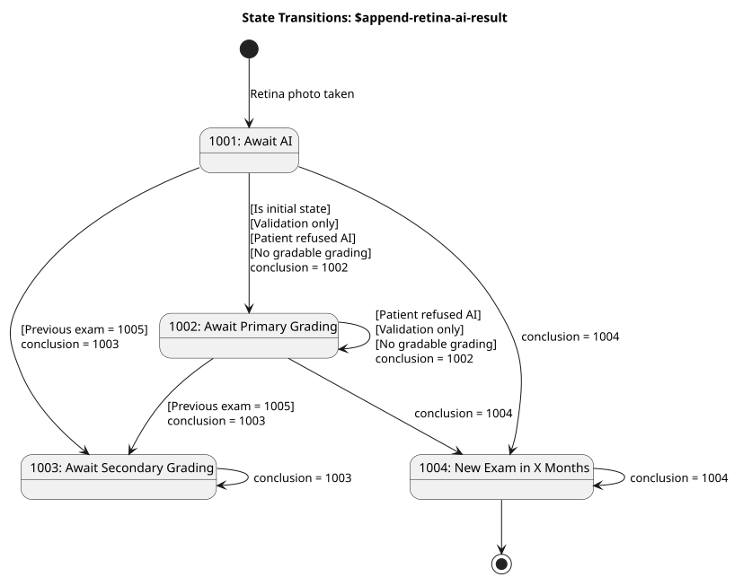

# Retina Append AI Result Operation - RetinaIntegration v0.9.1

## OperationDefinition: Retina Append AI Result Operation 

 
OperationDefinition for appending retina AI results to an existing DiagnosticReport. 

### Overview

The `$append-retina-ai-result` operation is used by the AI Integrator to add AI analysis results to an existing DiagnosticReport.

### Example

See [RetinaAppendAIResultOperation-Example](Parameters-RetinaAppendAIResultOperation-Example.json.md) for an example of the parameters.

### Usage

Add AI result to an examination using the following operation:

```
[baseUrl]/DiagnosticReport/[id]/$append-retina-ai-result

```

`[id]` is the identifier UUID (Universally Unique Identifier), sometimes referred to as a GUID, of the DiagnosticReport, a.k.a. an examination, to update.

### States and state transitions

The **state** of an examination is determined by the `DiagnosticReport.conclusionCode` (1000 series).

These are the guard conditions for entering one state from another state:

* ****Is initial state**** The examination must exit the initial state.
* ****Previous=1005**** If the previous examination concluded with [1005](CodeSystem-retina-conclusion-code-cs.md#retina-conclusion-code-cs-1005), the current examination shall go to secondary grading.
* ****Patient refused AI**** When a patient refuses AI-assisted grading, the input from AI is not allowed to influence the grading process.
* ****Validation only**** If the input is for validation only, the input should not influence the grading process.
* ****No gradable grading**** A conclusion from the AI integrator that is based on AI grading requires at least one gradable eye grading result.

The API strives to be lenient on input. If input from AI integrator does not conform to these rules, the input will be persisted, but the status of the examination will remain unchanged rather than being set to the proper next process step.

If the desired new state is not achieved, the API will return 200 and explain the issue in Operation Outcome in the body of the response. (Marked as OK- in the table.)

#### State Transition Table

| | | | | | | |
| :--- | :--- | :--- | :--- | :--- | :--- | :--- |
| 1 | 1001 | 1001 | Is initial state | 1002 | OK- | Set 1002 not 1001, because examination is not allowed to continue to await AI. |
| 2 | 1001 | 1002 | Previous=1005 | 1003 | OK- | Set 1003, not 1002, because the previous examination concluded with directly to secondary grading. |
| 3 | 1001 | 1002 | Validation only | 1002 | OK | OK to set 1002, because primary grading is correct also when validating. |
| 4 | 1001 | 1002 | None | 1002 | OK | OK to set 1002, examination moved to primary grading. |
| 5 | 1001 | 1003 | Previous=1005 | 1003 | OK | OK to set 1003, because the previous examination concluded with directly to secondary grading. |
| 6 | 1001 | 1003 | Validation only | 1002 | OK- | Set 1002, not 1003, because input was only for validation. |
| 7 | 1001 | 1003 | Patient refused AI | 1002 | OK- | Set 1002, not 1003, because patient refused AI. |
| 8 | 1001 | 1003 | No gradable grading | 1002 | OK- | Set 1002, not 1003, because the payload does not indicate successful grading. |
| 9 | 1001 | 1003 | None | 1003 | OK | Skips primary grading and goes to secondary grading based on AI findings. |
| 10 | 1001 | 1004 | Previous=1005 | 1003 | OK- | Set 1003, not 1004, because the previous examination concluded with directly to secondary grading. |
| 11 | 1001 | 1004 | Validation only | 1002 | OK- | Set 1002, not 1004, because input was only for validation. |
| 12 | 1001 | 1004 | Patient refused AI | 1002 | OK- | Set 1002, not 1004, because the patient has refused AI. |
| 13 | 1001 | 1004 | No gradable grading | 1002 | OK- | Set 1002, not 1004, because the payload does not indicate successful grading. |
| 14 | 1001 | 1004 | None | 1004 | OK | Set 1004: New screening examination in X months. This is the happy case which will have most of the traffic. |
| 15 | 1002 | 1002 | None | 1002 | OK | OK, no change. |
| 16 | 1002 | 1003 | Patient refused AI | 1002 | OK- | Do not set 1003, because the patient has refused AI. |
| 17 | 1002 | 1003 | Validation only | 1002 | OK | Do not set 1003, because input was only for validation. |
| 18 | 1002 | 1003 | None | 1003 | OK | Examination was awaiting primary grading but AI integrator wants it to go to secondary grading. |
| 19 | 1002 | 1004 | Previous=1005 | 1003 | OK- | Set 1003, not 1004, because previous examination concluded with directly to secondary grading. |
| 20 | 1002 | 1004 | Validation only | 1002 | OK- | Do not set 1004, because input was only for validation. |
| 21 | 1002 | 1004 | Patient refused AI | 1002 | OK- | Do not set 1004, because the patient has refused AI. |
| 22 | 1002 | 1004 | No gradable grading | 1002 | OK- | Do not set 1004, because the payload does not indicate successful grading. |
| 23 | 1002 | 1004 | None | 1004 | OK | AI Integrator handles an examination that was awaiting primary grading. |
| 24 | 1003 | 1002 | Illegal transition | 1003 | OK- | Do not set 1002 because regression from secondary to primary grading is not allowed. |
| 25 | 1003 | 1003 | None | 1003 | OK | OK, no change. |
| 26 | 1003 | 1004 | Illegal transition | 1003 | OK- | Do not set 1004, because cannot finalize an examination awaiting secondary grading. |
| 27 | 1004, 1005, 1006, 1007 | Same as current | None | Same as current | OK | State remains unchanged, as desired. |
| 28 | 1004, 1005, 1006, 1007 | Different from current | None | Same as current | OK- | State remains unchanged because you cannot change a final state. |

How to read the table:

1. ****Current state****is the current state of the examination in EyeCare
1. ****Desired state****is the desired new state received in the`conclusion`parameter in the API
1. ****Guard Conditions****are rules that dictates what the next state will be. Read from top and downward. Guard conditions take precedence over the desired next state from the API conclusion.
1. ****Next State****is the actual next state after the append operation is executed. It may differ from the desired state depending on the guard conditions.
1. ****Result****is OK- (OK minus) if the outcome is not exactly what the AI integrator desired.
1. ****Notes****are explanation of the outcome.

#### State Catalog

These are the states that an examination may be in, as determined by the conclusion code. Ref. [retina-conclusion-code-cs](CodeSystem-retina-conclusion-code-cs.md).

| | | | | |
| :--- | :--- | :--- | :--- | :--- |
| 1001 | Await AI | Retina photo is taken | Input from AI integrator is received, or manual grading is done. | Initial |
| 1002 | Await primary grading | Photographer ordered primary grading | Primary grading is done |   |
| 1003 | Await secondary grading | Ordered in EyeCare by primary grader or previous examination ordered directly to secondary grading (1005). | Secondary grading is done |   |
| 1004 | New examination in X months | Ordered in EyeCare |   | Final |
| 1005 | New examination in X months directly to secondary grading | Ordered in EyeCare |   | Final |
| 1006 | Screening program is suspended for the patient. | Ordered in EyeCare |   | Final |
| 1007 | Patient is discharged from the screening program | Ordered in EyeCare |   | Final |

#### Event Catalog for the AI integrator

These are the states the AI integrator is allowed to set as target state if it wants to change the state from current state. Ref. [retina-append-ai-conclusion-vs](ValueSet-retina-append-ai-conclusion-vs.md)

| | | | |
| :--- | :--- | :--- | :--- |
| 1002 | Primary grading current examination | Optional AI grading | AI is not able to grade pictures |
| 1003 | Secondary grading current examination | Optional AI grading | AI grading indicates that something is wrong. |
| 1004 | New screening examination in X months | Gradable AI grading, recall interval | No need for further grading in this examination. |

### State transitions instigated by the append operation

This diagram shows the state transitions when AI integrator wants to change the state of an examination. The guard conditions are represented in brackets []. The guard conditions always takes precedence over the desired conclusion coming in through the API operation.



Example: The examination is in state 1001, awaiting AI grading.. AI evaluates that the eyes are good and the integrator concludes that next state should be 1004. The API service sees that the previous examination concluded with 1005 and therefore sets the next state to 1003.

In summary, the AI integrator can only advance the state of an examination that is in state 1001 or 1002. For all other states, the operation is accepted and the payload is persisted, but the conclusion code remains unchanged.

### Global Rules

* The append operation is not idempotent. A given examination may only receive one successful AI integrator update. If the result is persisted, the result cannot be changed through API.

### HTTP response codes

| | | | |
| :--- | :--- | :--- | :--- |
| 204 | Success | The operation completed successfully and the DiagnosticReport was updated with the desired state. | Yes |
| 200 | Success But | The operation completed successfully but there are issues in Operation Outcome. | Yes |
| 400 | Bad Request | The request was malformed or contained invalid parameters. | No |
| 401 | Unauthorized | The server was not able to authenticate the user so authorization could not be done. | No |
| 403 | Forbidden | The user is not authorized to use the API. | No |
| 404 | Not Found | No DiagnosticReport with the given`[id]`was found. | No |
| 409 | Conflict | DiagnosticReport`[id]`already has a grading, or`sectraStudyId`is linked to another examination. | No |
| 422 | Unprocessable Entity | The request was well-formed but violated business rules (e.g. missing required parameter combinations). | No |
| 500 | Internal Server Error | An unexpected server-side error occurred. | No |


## Resource Content

```json
{
  "resourceType" : "OperationDefinition",
  "id" : "append-retina-ai-result",
  "url" : "http://dips.no/fhir/RetinaIntegration/OperationDefinition/append-retina-ai-result",
  "version" : "0.9.1",
  "name" : "AppendRetinaAIResult",
  "title" : "Retina Append AI Result Operation",
  "status" : "draft",
  "kind" : "operation",
  "date" : "2026-06-08T15:50:57+02:00",
  "publisher" : "DIPS AS",
  "contact" : [{
    "name" : "DIPS AS",
    "telecom" : [{
      "system" : "url",
      "value" : "http://dips.no/"
    },
    {
      "system" : "email",
      "value" : "teamsolsiden@dips.no"
    }]
  }],
  "description" : "OperationDefinition for appending retina AI results to an existing DiagnosticReport.",
  "purpose" : "Append results from AI analysis of retina images to a existing DiagnosticReport",
  "code" : "append-retina-ai-result",
  "resource" : ["DiagnosticReport"],
  "system" : false,
  "type" : false,
  "instance" : true,
  "parameter" : [{
    "name" : "sectraStudyId",
    "use" : "in",
    "min" : 0,
    "max" : "1",
    "documentation" : "Sectra study ID for the retinal images that were analyzed.",
    "type" : "string"
  },
  {
    "name" : "conclusion",
    "use" : "in",
    "min" : 1,
    "max" : "1",
    "documentation" : "Conclusion indicating the next step. It MUST be a single code from the 1000 series. To achieve a state change, the conclusion must be one of the [goal states applicable for AI integration](ValueSet-retina-append-ai-conclusion-vs.html): 1002 , 1003 or 1004. Refer to the state machine diagram for details.",
    "type" : "CodeableConcept",
    "binding" : {
      "strength" : "required",
      "valueSet" : "http://dips.no/fhir/RetinaIntegration/ValueSet/retina-conclusion-code-vs"
    }
  },
  {
    "name" : "monthsUntilNextExamination",
    "use" : "in",
    "min" : 0,
    "max" : "1",
    "documentation" : "The recall interval in months until the patient's next examination. Must be included if the conclusion is a 1004 or 1005. Value must be a positive integer greater than 1",
    "type" : "integer"
  },
  {
    "name" : "leftGradability",
    "use" : "in",
    "min" : 0,
    "max" : "1",
    "documentation" : "Gradability of the left eye for AI analysis. Must be a single code from the Retina AI Gradability ValueSet.",
    "type" : "code",
    "binding" : {
      "strength" : "required",
      "valueSet" : "http://dips.no/fhir/RetinaIntegration/ValueSet/retina-ai-gradability-vs"
    }
  },
  {
    "name" : "rightGradability",
    "use" : "in",
    "min" : 0,
    "max" : "1",
    "documentation" : "Gradability of the right eye for AI analysis. Must be a single code from the Retina AI Gradability ValueSet.",
    "type" : "code",
    "binding" : {
      "strength" : "required",
      "valueSet" : "http://dips.no/fhir/RetinaIntegration/ValueSet/retina-ai-gradability-vs"
    }
  },
  {
    "name" : "leftDiabeticRetinopathy",
    "use" : "in",
    "min" : 0,
    "max" : "1",
    "documentation" : "Left eye diabetic retinopathy evaluation, a decimal between 0.0 and 5.0",
    "type" : "decimal"
  },
  {
    "name" : "leftDiabeticMacularEdema",
    "use" : "in",
    "min" : 0,
    "max" : "1",
    "documentation" : "Left eye diabetic macular edema evaluation. True if diabetic macular edema is present.",
    "type" : "boolean"
  },
  {
    "name" : "rightDiabeticRetinopathy",
    "use" : "in",
    "min" : 0,
    "max" : "1",
    "documentation" : "Right eye diabetic retinopathy evaluation, a decimal between 0.0 and 5.0",
    "type" : "decimal"
  },
  {
    "name" : "rightDiabeticMacularEdema",
    "use" : "in",
    "min" : 0,
    "max" : "1",
    "documentation" : "Right eye diabetic macular edema evaluation. True if diabetic macular edema is present.",
    "type" : "boolean"
  },
  {
    "name" : "rightEyeImage",
    "use" : "in",
    "min" : 0,
    "max" : "*",
    "documentation" : "Right eye images used in the AI analysis. MUST conform to RetinaImageParameter profile.",
    "type" : "Observation",
    "targetProfile" : ["http://dips.no/fhir/RetinaIntegration/StructureDefinition/retina-image-parameter"]
  },
  {
    "name" : "leftEyeImage",
    "use" : "in",
    "min" : 0,
    "max" : "*",
    "documentation" : "Left eye images used in the AI analysis. MUST conform to RetinaImageParameter profile.",
    "type" : "Observation",
    "targetProfile" : ["http://dips.no/fhir/RetinaIntegration/StructureDefinition/retina-image-parameter"]
  },
  {
    "name" : "aiDevice",
    "use" : "in",
    "min" : 0,
    "max" : "1",
    "documentation" : "AI Device that performed the analysis. Includes AI product name, algorithm version and protocol version.",
    "type" : "Device",
    "targetProfile" : ["http://dips.no/fhir/RetinaIntegration/StructureDefinition/retina-ai-device"]
  },
  {
    "name" : "performedDateTime",
    "use" : "in",
    "min" : 0,
    "max" : "1",
    "documentation" : "Date and time when the retinal AI analysis was performed.",
    "type" : "dateTime"
  },
  {
    "name" : "cameraDevice",
    "use" : "in",
    "min" : 0,
    "max" : "1",
    "documentation" : "Camera device used to capture the retinal images.",
    "type" : "Device",
    "targetProfile" : ["http://dips.no/fhir/RetinaIntegration/StructureDefinition/retina-camera-device"]
  },
  {
    "name" : "fullReport",
    "use" : "in",
    "min" : 1,
    "max" : "1",
    "documentation" : "Technical details for further reference about the AI grading.",
    "type" : "Attachment"
  },
  {
    "name" : "validation",
    "use" : "in",
    "min" : 1,
    "max" : "1",
    "documentation" : "Set true if the AI result is for validation purposes only and will not be used in clinical decision making.",
    "type" : "boolean"
  }]
}

```
