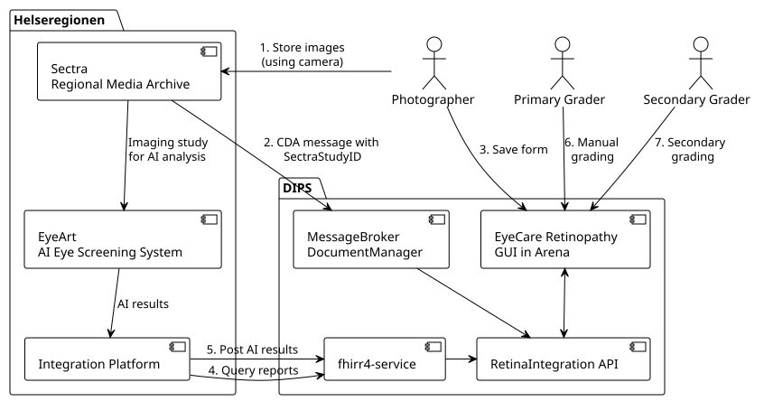

# Home - RetinaIntegration v0.8.0

## Home

### RetinaIntegration API

RetinaIntegration is an API for integrating with the DIPS EyeCare-retinopathy application which is used in the retinopathy screening of diabetic patients.

The purpose of the API is to for an AI solution to discover examinations that is waiting for grading, get the details about those examinations, and report back any AI findings concerning those findings and what the next step should be.

### System Components and Interactions

The following diagram shows some of the components and their interactions. The regional system, the client, consists of a media archive, an integration platform with some business logic, and an AI system. For the purpose of this discussion we consider the AI system and the integration platform as one system.

The DIPS system consist of the EyeCare application and the Retina Integration API, among other things.

1. Photographer starts taking retina pictures.
* When image series is completed the AI system grades the imaging study.

1. The media archive sends a message to DIPS with the new SectraStudyId.
* A ImagingStudy is added to the report with status `registered`
* The status of the diagnostic report will be `partial`

1. Photographer stores and approves the photographer form in EyeCare.
* DIPS creates a DiagnosticReport for the new retina examination with status `registered`
* If there is a SectraStudyId that matches the patient and examination timeframe the status will be `partial`

1. Integration platform queries for DiagnosticReports that is pending AI grading
1. Integration platform appends image information, evaluations and conclusions
* Imaging study will be `available`
* Diagnostic report status will be `partial` or `final` depending on the conclusion

1. Manual grader optionally examines the pictures reaches a conclusion
* The report status will be `partial`or `final` depending on conclusion

1. Secondary grader optionally examines the pictures
* The report status will be `partial`or `final` depending on conclusion

The numbers indicates a possible sequence of the signals and actions. There may be many variations of this sequences.

The system will also handle appending AI grading when the report is in a final state. This may happen if the examination is manually graded before before it was graded by AI. Report will then be in state `appended`. It may also be possible for AI-system to append gradings based on several imaging studies.

### Operations

* Query for getting reports by date [Retina Query By Date Operation](OperationDefinition-retina-by-date.md)
* Operation for appending AI result [AppendRetinaAIResult OperationDefinition](OperationDefinition-append-retina-ai-result.md)

